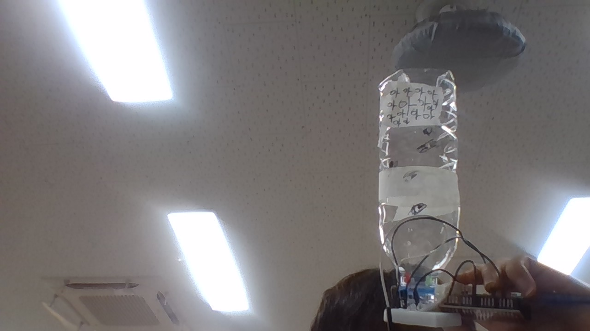

# 🌱 에코아트 프로젝트: [작품명]

## 📖 프로젝트 개요
- **제작자**: [이름]
- **제작일**: [날짜]
- **소개**
> 우리 작품이 어떤 환경 문제를 다루고 있는지, 어떤 메시지를 전달하고 싶은지 자유롭게 설명해주세요.
> (예: 저희는 버려지는 플라스틱 쓰레기 문제의 심각성을 알리기 위해...)

## 📦 사용 재료
- 아두이노, 온도센서, LED, 브레드보드
- 페트병, 그림 도안 등

## 🔧 제작 과정

### 1단계: 아이디어 스케치

- 아이디어 설명
- 예상 완성도

### 2단계: 완성품

## 💭 제작 후기
### 잘된 점
- 열심히 했다

### 아쉬운 점
- 선배들의 도움을 많이받았다

### 개선할 점
- 작품에 완성도

### 내가 이미 알고 있었던 것
- 코딩을 약간 알고있었다

### 새롭게 배운게 된 것
- 아두이누에대해 배웠다

### 더 알고 싶은 것
- 아두이누에대해더 알고싶다

## 🌍 환경적 의미
- 쓰레기로 작품을 만들수있다
- 자연지키기
- 환경오염을 막

## 📚 참고 자료
- [환경 관련 웹사이트](링크)
- [참고한 에코아트 작품](링크)

## 🏷️ 태그
#에코아트 #재활용 #환경보호 #DIY #창의활동

---

> 이 프로젝트는 환경 보호와 창의적 사고를 위한 교육 목적으로 제작되었습니다.
